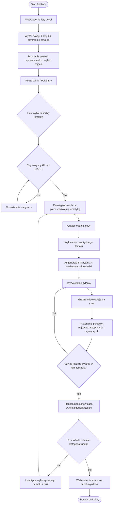

# 🎮 QuizApp Multiplayer

Aplikacja do quizów wieloosobowych w czasie rzeczywistym. Gracze mogą dołączać do pokoi, wybierać kategorie i rywalizować ze sobą, odpowiadając na generowane pytania.

## 🛠️ Stos Technologiczny

- **Frontend:** React, Vite, TypeScript, Zustand, React Router
- **Backend:** .NET 9 Web API, SignalR (Real-time komunikacja)
- **Baza Danych / Cache:** Redis (Backplane dla SignalR, stan gry)
- **Infrastruktura:** Proxmox (Ubuntu Server), Docker, Terraform
- **AI:** OpenAI API / Lokalny LLM (Ollama) do generowania pytań

## 📁 Struktura Projektu

- `/backend` - Kod źródłowy API w .NET oraz Huby SignalR.
- `/frontend` - Aplikacja kliencka w React/Vite.
- `/infrastructure` - Skrypty Terraform do wdrażania na serwer Proxmox.

## Diagram rozgrywki

